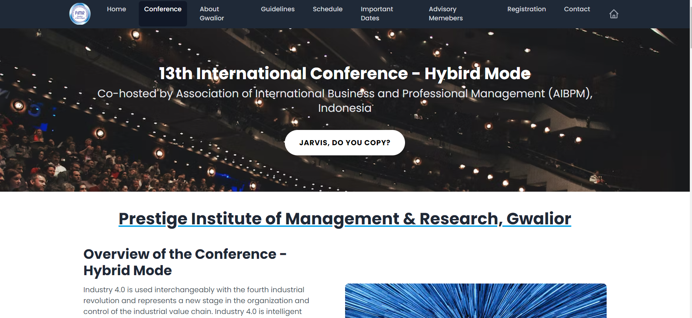

# International Conference Website 🌐

## Prestige Institute of Management and Research, Gwalior

[](https://app.netlify.com/sites/statuesque-moxie-abc30a/deploys)

Welcome to the International Conference website, hosted by Prestige Institute of Management and Research, Gwalior. This platform serves as an interactive hub for scholars, students, and professionals to participate in the conference, submit research papers, and engage in knowledge exchange.

## About the Conference 📚

The International Conference is an annual event organized by Prestige Institute of Management and Research, Gwalior, to facilitate the exchange of ideas, research, and knowledge. Scholars, students, and professionals from various fields come together to submit research papers, articles, and engage in academic discussions.

## Project Overview 🚀

This website is designed to provide information about the conference, its schedule, speakers, and submission guidelines. It allows participants to submit their research papers, view conference updates, and register for the event. The site is hosted on Netlify at [International Conference](https://statuesque-moxie-abc30a.netlify.app).

## Features and Functionality 🌟

- Conference Schedule and Agenda.
- Speaker Profiles and Session Details.
- Research Paper Submission Portal.
- Registration for Conference Participation.
- Event Updates and Notifications.

## Technology Stack 🛠️

<p align="left">


</p>

## Installation Steps 📦

To set up the project locally, follow these steps:

1. **Clone the Repository:**

   ```bash
   git clone https://github.com/Ravikisha/International-Conference.git
   cd International-Conference
   ```

2. **Install Dependencies:**

   Install the required Node.js packages.

   ```bash
   npm install
   ```

3. **Run the Development Server:**

   Start the development server to run the project locally.

   ```bash
   npm start
   ```

4. **Access the Local Project:**

   Open your web browser and visit `http://localhost:3000` to see the project in action.

## How to Contribute 🤝

We welcome contributions from developers, designers, and enthusiasts who want to make the International Conference website even better. You can help by adding new features, improving the design, fixing bugs, or enhancing the user experience.

1. **Fork the Repository:**

   Click the "Fork" button to create your copy of this repository.

2. **Clone Your Fork:**

   ```bash
   git clone https://github.com/Ravikisha/International-Conference.git
   cd International-Conference
   ```

3. **Create a Branch:**

   Create a new branch for your contribution.

   ```bash
   git checkout -b your-branch-name
   ```

4. **Make Your Contribution:**

   Contribute your changes to the project.

5. **Commit Your Changes:**

   ```bash
   git commit -m "Your commit message"
   ```

6. **Push Your Changes:**

   Push your changes to your fork.

   ```bash
   git push origin your-branch-name
   ```

7. **Create a Pull Request:**

   Go to the original repository and create a pull request with your changes.

## License 📜

This project is open-source and is licensed under the MIT License. See the [LICENSE](LICENSE) file for details.

The International Conference website serves as a platform for academic collaboration, research paper submissions, and knowledge exchange. We invite you to explore and contribute to this project to make it even more valuable to our academic community. 🌍📊

For more information, contact us at [@RaviKishan](mailto:ravikishan63392@gmail.com).